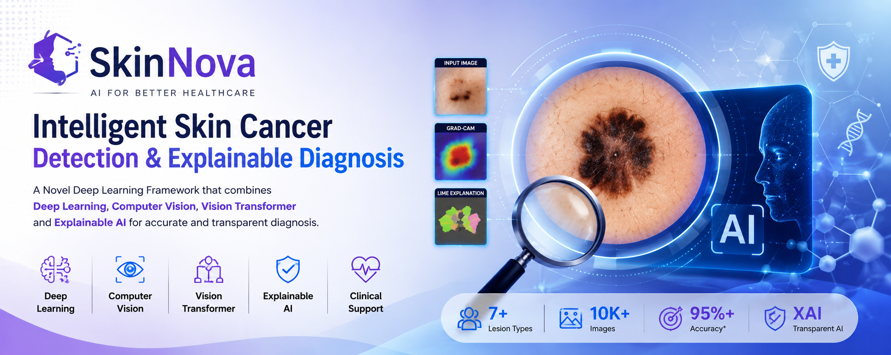

# SkinNova: A Novel Deep Learning Framework for Skin Cancer Detection and Explainable Diagnosis

<p align="center">
  
</p>

<p align="center">


</p>

---

# 📌 Overview

**SkinNova** is a **novel Explainable Artificial Intelligence (XAI) framework** designed for **automatic skin cancer detection and diagnosis** using dermoscopic images.

Unlike conventional deep learning approaches that function as **black-box models**, SkinNova integrates **image preprocessing, lesion segmentation, hybrid deep learning, explainable AI, confidence estimation, and clinical recommendations** into a unified intelligent framework.

The system is intended to assist dermatologists by improving diagnostic accuracy while increasing transparency and trust in AI-assisted healthcare.

---

# 🎯 Project Vision

To develop an intelligent AI-powered clinical decision support system capable of accurately detecting skin cancer while providing transparent visual explanations that enhance clinician confidence and facilitate early diagnosis.

---

# 🎯 Aim

To develop **SkinNova**, a novel explainable deep learning framework capable of accurately detecting and classifying multiple skin cancer types from dermoscopic images while providing interpretable visual explanations, confidence scores, and AI-assisted clinical recommendations.

---

# 🚨 Problem Statement

Skin cancer is among the most common cancers worldwide, with melanoma being one of the deadliest forms if not detected early.

Although deep learning models have achieved impressive diagnostic accuracy, most existing systems lack transparency and interpretability, making it difficult for clinicians to trust AI-generated decisions.

Furthermore, variations in image quality, hair artifacts, shadows, noise, and class imbalance continue to limit the robustness of many automated diagnostic systems.

SkinNova addresses these challenges by integrating explainable AI, hybrid deep learning, intelligent preprocessing, and clinical decision support into a single deployable framework.

---

# 🎯 Objectives

## Primary Objectives

- Develop an automated AI framework for skin cancer detection.
- Detect and classify seven different skin lesion categories.
- Improve diagnostic accuracy using hybrid deep learning.
- Reduce false positives and false negatives.
- Support early diagnosis through intelligent image analysis.

## Explainability Objectives

- Generate Grad-CAM heatmaps.
- Generate LIME explanations.
- Highlight lesion regions responsible for prediction.
- Improve transparency of AI predictions.
- Increase clinician trust.

## Innovation Objectives

- Remove image artifacts.
- Segment lesions before classification.
- Handle class imbalance.
- Perform cross-dataset validation.
- Compare multiple state-of-the-art models.
- Develop an interactive deployment platform.
- Generate downloadable diagnostic reports.

---

# ✨ Key Features

- AI-powered Skin Cancer Detection
- Seven-Class Skin Lesion Classification
- Automatic Image Quality Assessment
- Hair Removal using Dull Razor Algorithm
- Noise Reduction
- Contrast Enhancement
- Lesion Segmentation
- Hybrid Deep Learning
- Explainable AI
- Confidence Estimation
- Risk Assessment
- Clinical Recommendation
- Interactive Dashboard
- PDF Diagnostic Report

---

# 🚀 Novel Contributions

SkinNova introduces several innovations beyond conventional skin cancer classification systems.

| **Innovation** | **Module** | **Description** | **Purpose / Research Contribution** |
|---|---|---|---|
| **Innovation 1** | **AI Image Quality Assessment** | Automatically evaluate uploaded dermoscopic images and reject blurry, low-resolution, or poor-quality images before analysis. | Improves input image quality, reduces prediction errors, and increases model reliability. |
| **Innovation 2** | **Hair & Artifact Removal** | Apply the OpenCV Dull Razor Algorithm to remove hairs and other artifacts from skin lesion images. | Eliminates visual obstructions that can negatively affect lesion segmentation and classification accuracy. |
| **Innovation 3** | **Image Enhancement & Noise Reduction** | Enhance lesion visibility using Contrast Limited Adaptive Histogram Equalization (CLAHE) and Bilateral Filtering. | Improves image contrast while preserving lesion boundaries, leading to better feature extraction. |
| **Innovation 4** | **Lesion Segmentation** | Segment the lesion region using U-Net or DeepLabV3+ before classification. | Focuses the model on the lesion area and removes irrelevant background information, improving classification performance. |
| **Innovation 5** | **Hybrid Deep Learning Framework** | Integrate EfficientNetV2 for local feature extraction with Vision Transformer (ViT) for capturing global contextual information. | Combines CNN and Transformer strengths to improve multi-class skin cancer classification accuracy and robustness. |
| **Innovation 6** | **Explainable Artificial Intelligence (XAI)** | Generate Grad-CAM heatmaps and LIME explanations to visualize the regions influencing the model's predictions. | Enhances transparency, interpretability, and clinician trust in AI-assisted diagnosis. |
| **Innovation 7** | **Confidence Score Estimation** | Display prediction probabilities and confidence scores for each skin lesion class. Example: Melanoma – 98.7% Confidence. | Provides prediction certainty, enabling clinicians to better assess AI recommendations. |
| **Innovation 8** | **Clinical Decision Support** | Generate AI-assisted clinical recommendations based on prediction confidence and lesion type, such as High Risk, Moderate Risk, and Low Risk. | Supports early diagnosis and assists healthcare professionals in prioritizing patient care. |
| **Innovation 9** | **Cross-Dataset Validation** | Train the model on the HAM10000 dataset and evaluate it on the ISIC dataset to assess generalization capability. | Demonstrates model robustness and reduces dataset-specific bias, increasing real-world applicability. |
| **Innovation 10** | **Interactive AI Dashboard** | Develop a Streamlit-based web application where users can upload an image, receive predictions, view Grad-CAM visualizations, confidence scores, and download a PDF diagnostic report. | Provides an end-to-end, user-friendly clinical decision support system suitable for real-world deployment. |

---

# 🏗 Proposed System Architecture

```text
Input Dermoscopic Image
            │
            ▼
Image Quality Assessment
            │
            ▼
Hair Removal
            │
            ▼
Noise Reduction
            │
            ▼
Contrast Enhancement
            │
            ▼
Lesion Segmentation (U-Net)
            │
            ▼
Data Augmentation
            │
            ▼
Hybrid Deep Learning
(EfficientNetV2 + Vision Transformer)
            │
            ▼
Feature Fusion
            │
            ▼
Skin Cancer Classification
            │
            ▼
Explainable AI
(Grad-CAM + LIME)
            │
            ▼
Confidence Estimation
            │
            ▼
Risk Assessment
            │
            ▼
Clinical Recommendation
            │
            ▼
Interactive Dashboard
```

---

# 🧠 Classification Classes

The proposed framework classifies the following seven skin lesion categories:

| Code | Disease |
|---|---|
| MEL | Melanoma |
| NV | Melanocytic Nevus |
| BCC | Basal Cell Carcinoma |
| AKIEC | Actinic Keratosis |
| BKL | Benign Keratosis |
| DF | Dermatofibroma |
| VASC | Vascular Lesion |

---

# 📂 Dataset

## Primary Dataset

HAM10000

Contains over 10,000 dermoscopic images representing seven categories of pigmented skin lesions.

---

## External Validation Dataset

ISIC Archive

Used to evaluate cross-dataset generalization and robustness.

---

# 🔬 Data Preprocessing

The preprocessing pipeline consists of:

- Image Resizing
- Normalization
- Hair Removal
- CLAHE
- Bilateral Filtering
- Data Augmentation
- Contrast Enhancement

---

# 🎨 Data Augmentation

The following augmentation techniques improve generalization:

- Rotation
- Horizontal Flip
- Vertical Flip
- Zoom
- Random Brightness
- Random Contrast
- Translation
- Shearing

---

# 🤖 Deep Learning Architecture

## Feature Extraction

EfficientNetV2

- Efficient feature learning
- Lightweight architecture
- Transfer learning support
- Strong feature extraction capability

---

## Transformer Branch

Vision Transformer

- Global attention mechanism
- Long-range dependency learning
- Global contextual feature extraction

---

## Feature Fusion

Features extracted from EfficientNetV2 and Vision Transformer are concatenated and passed through dense layers for final classification.

---

# 🔍 Explainable AI

## Grad-CAM

Grad-CAM highlights important image regions that contribute to the prediction.

Benefits:

- Transparent prediction
- Visual clinical support
- Improved interpretability
- Trustworthy diagnosis support

---

## LIME

LIME provides local explanations for each individual prediction.

Benefits:

- Human-understandable explanation
- Local feature importance
- Prediction-level interpretability

---

# 📊 Evaluation Metrics

The model is evaluated using:

- Accuracy
- Precision
- Recall
- F1 Score
- Specificity
- Sensitivity
- ROC-AUC
- Confusion Matrix
- Matthews Correlation Coefficient
- Cohen's Kappa

---

# 💻 Technology Stack

| Module | Technology |
|---|---|
| Programming Language | Python |
| Deep Learning | TensorFlow |
| Framework | Keras |
| Image Processing | OpenCV |
| Segmentation | U-Net |
| Classifier | EfficientNetV2 + Vision Transformer |
| Explainability | Grad-CAM, LIME |
| Visualization | Matplotlib, Plotly |
| Deployment | Streamlit |
| Database | SQLite / MySQL |
| IDE | VS Code, Jupyter Notebook |

---

# 🌐 Web Application Features

The web dashboard provides:

- Image Upload
- Real-Time Prediction
- Confidence Score
- Disease Information
- Grad-CAM Visualization
- LIME Visualization
- Clinical Recommendation
- Download PDF Report
- Prediction History

---

# 📈 Expected Outcomes

- High diagnostic accuracy
- Improved robustness
- Better model generalization
- Clinically interpretable predictions
- Increased trust in AI-assisted diagnosis
- Early detection support

---

# 📁 Project Structure

```text
SkinNova/
│
├── datasets/
│   ├── HAM10000/
│   └── ISIC/
│
├── preprocessing/
│   ├── quality_assessment.py
│   ├── hair_removal.py
│   ├── enhancement.py
│   └── augmentation.py
│
├── segmentation/
│   ├── unet_model.py
│   └── deeplabv3plus.py
│
├── models/
│   ├── efficientnetv2_model.py
│   ├── vit_model.py
│   └── hybrid_model.py
│
├── explainability/
│   ├── gradcam.py
│   └── lime_explainer.py
│
├── training/
│   ├── train.py
│   └── config.py
│
├── evaluation/
│   ├── evaluate.py
│   ├── confusion_matrix.py
│   └── metrics.py
│
├── reports/
│   └── diagnostic_report.py
│
├── app/
│   └── streamlit_app.py
│
├── static/
│
├── docs/
│
├── requirements.txt
├── README.md
└── LICENSE
```

---

# 🔮 Future Scope

- Mobile Application
- Federated Learning
- Multi-modal Diagnosis
- Real-Time Clinical Integration
- Electronic Health Record Integration
- Cloud Deployment
- Edge AI Deployment
- Skin Cancer Severity Prediction
- Treatment Recommendation
- Large Language Model Integration for Clinical Assistance

---

# 👨‍💻 Author

**Shreshta Saha & Soumya Deep Saha**

MCA Student

Artificial Intelligence & Machine Learning Researcher

Deep Learning | Computer Vision | Explainable AI | Medical AI

---

# 📜 License

This project is intended for research and educational purposes.

---

# ⚠ Medical Disclaimer

SkinNova is an AI-assisted clinical decision support system designed for research and educational purposes.

The predictions generated by this system should **not** be considered a substitute for professional medical diagnosis, treatment, or clinical judgment.

Always consult a qualified dermatologist or healthcare professional for medical advice.

---

# ⭐ Acknowledgements

- HAM10000 Dataset
- ISIC Archive
- TensorFlow
- OpenCV
- Streamlit
- Keras
- Vision Transformer Research Community
- Explainable AI Research Community

---

## If you find this project useful, consider giving it a ⭐ on GitHub.
